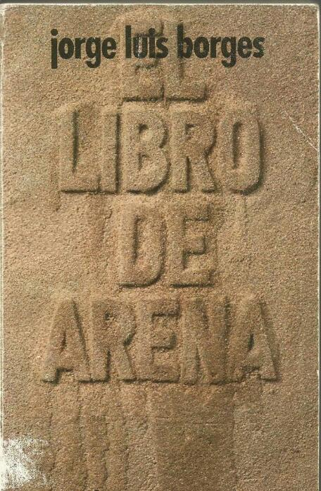
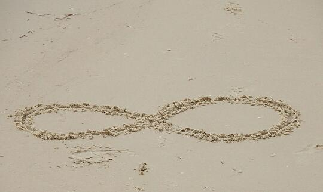

<!DOCTYPE html>
<html lang="en">

<head>
    <meta charset="UTF-8">
    <meta name="viewport" content="width=device-width, initial-scale=1.0">
    <meta http-equiv="X-UA-Compatible" content="ie=edge">
    <meta name="description" content="Fermin Cirella website" />
    <meta property="og:title" content="Borges - Literatura" />
    <meta property="og:description" content="Fermin Cirella website" />
    <meta property="og:image" content="https://fermin.ga/literatura/logo.jpg" />
    <link rel="shortcut icon" href="../favicon.ico" type="image/x-icon" />
    <link rel="stylesheet" href="https://stackpath.bootstrapcdn.com/bootstrap/4.1.1/css/bootstrap.min.css">
    <link href="https://fonts.googleapis.com/css?family=Roboto:300,400" rel="stylesheet">
    <link href="style.css?v=1.2" rel="stylesheet">
    <title>Borges - Literatura</title>
    
</head>

<body class="content dark">
    
    <header class="container-fluid borges">
        

            

                <h1>Borges</h1>
            

            <!--
            

                <button type="button" onclick="mode()" class="btn btn-dark btn-sm">OSCURO</button>
            
-->

            

                
            

        

        

            <ul class="nav nav-tabs" id="myTab" role="tablist">
                <li class="nav-item">
                    <a class="nav-link active" id="home-tab" data-toggle="tab" href="#home" role="tab" aria-controls="home" aria-selected="true">Inicio</a>
                </li>
                <li class="nav-item">
                    <a class="nav-link" id="profile-tab" data-toggle="tab" href="#profile" role="tab" aria-controls="profile" aria-selected="false">Proyecto</a>
                </li>
                <li class="nav-item">
                    <a class="nav-link" id="contact-tab" data-toggle="tab" href="#contact" role="tab" aria-controls="contact" aria-selected="false">Cuento</a>
                </li>
            </ul>
        

    </header>

    

        

            

                

                    

                        

                            <h3 style="text-align: center">Cuento
                                 
                            </h3>
                            <h2 style="text-align: center" class="display-4">El Libro de Arena
                                 
                            </h2>
                        

                        

                            
                        

                    

                    <article>
                         
                        <h3>Introducción</h3>
                        
Dedicamos esta página al análisis de los conceptos encontrados en el cuento "El Libro de Arena" de
                            Jorge Luis Borges.

                        
Este cuento narra la historia de un hombre, interpretado por Borges, que vivia solo en su apartamento.
                            Un día recibe la visita de un vendedor de biblias. Borges las rechaza ya que tiene muchas, entonces
                            le ofrece un libro misterioso, el "Libro de los Libros". Este libro se llamaba "El Libro de Arena"
                            ya que como la arena, no tiene principio ni fin. El asombro del protagonista era inimaginable.
                            La idea de un libro infinito lo consumió. Lo analizaba día y noche, no lo podia dejar. Quemarlo,
                            pensó, pero la ídea del humo infinito lo asustaba. Así que decidió esconderlo en la biblioteca
                            donde el trabajaba y jamás volver a pasar por allí.
                        

                        <blockquote class="blockquote">
                            
Siento un poco de alivio, pero no quiero ni pasar por la calle México.

                            <footer class="blockquote-footer">El Libro de Arena</footer>
                        </blockquote>

                    </article>
                    

                    <article>
                        
Antes del escritor argentino Jorge Luis Borges, (1899-1986) muchos escritores, filósofos y matemáticos
                            jugaron con el lenguaje tratando de analizar y descifrar el infinito.

                        
En El Libro de Arena, el autor nos muestra una visión inesperada del concepto del infinito.

                        
En este cuento corto que lleva el mismo nombre que el título del libro, el personaje es visitado
                            por un vendedor de biblias quien después de una breve introducción le ofrece un libro especial:
                            "No sólo vendo biblias. Puedo mostrarle un libro sagrado que tal vez le interese. Lo adquirí
                            en los confines de Bikanir."
                        

                        
¿Qué clase libro puede un vendedor mostrarle a Borges  —el escritor— que pueda llamarle su atención?
                            Borges —un profesor de literatura inglesa— y bibliotecario con una gran cantidad de libros de
                            su propiedad estaba acostumbrado a ver toda clase de ejemplares.

                        
Borges abrió el libro aleatoriamente sólo para encontrase que las páginas estaban desgastadas, y
                            en texto ininteligible, letras apretadas y pobre tipografía. Pero eso no fue sorpresa para él,
                            la verdadera sorpresa estaba en la numeración de las páginas las cuales no tenían ni principio
                            ni fin.

                        
La metáfora de la arena entra perfecta en este libro. Cuando vas a la playa y tomes un puñado de
                            arena, déjalo caer todo excepto por un grano. Miralo bien, porque nunca más lo volveras a ver.
                            No puedes volver atrás en el libro.

                        
El libro era tan misterioso y extraño que incluso carecía de una primera página, no porque no había
                            el número 1 en la primera página, sino porque de alguna manera inexplicable siempre aparecían
                            más y más páginas entre la portada del libro y la primera página.

                        
El personaje menciona varios ejemplares de biblias:

                        <h3>En palabras de Borges:</h3>
                        <blockquote class="blockquote">
                            

                                <a href="#/" role="button" class="popovers" data-toggle="popover" title="" data-content="<a href='http1://www.lanueva.com/nota/2004-6-26-9-0-0-borges-la-biblia-y-los-militares' target='_blank' title='Diario La Nueva'>Diario La Nueva</a>"
                                    data-original-title="Fuente">¿De dónde viene mi pasión prohebrea?</a>
                                Yo creo que eso puede explicarse de muchas maneras. Ante todo, mi abuela, inglesa, protestante, que sabía de memoria la Biblia.
                                Yo me crié en ese ambiente. Mi madre, católica. Una de mis abuelas, protestante: Church of
                                England (Iglesia de Inglaterra) con ascendencia puritana. Mi padre, agnóstico. Y todos nos
                                llevábamos muy bien.
                            

                            
La biblia tiene que haber influido en mí, y por allí tengo una familiaridad con los hebreos.
                                A mi abuela le citaban un pasaje de la Biblia y ella decía: sí, versículo tal, libro tal,
                                y recitaba lo que seguía.

                            <footer class="blockquote-footer">Jorge Luis Borges</footer>
                        </blockquote>
                        
Borges, en toda su genialidad, inventa un tipo de libro que no existe y que solo puede generar locura
                            y desconcierto en la persona que lo lea. El autor juega con cruzamientos de hojas, palabras y
                            números, como si este libro fuera una torre de Babel donde todo lenguaje se convierte en incomprensible,
                            al punto de generar desesperación en el personaje principal.

                        
El libro de arena es un cuento fantástico que le demuestra al hombre que no está hecho para aceptar
                            verdades que escapen a su limitada conciencia. El vendedor de biblias se deshizo de él al igual
                            que lo llevó a cabo el protagonista de este relato: ninguno de los dos pudo hacerse cargo de
                            la magia infinita que el texto sagrado ocultaba en su seno.

                    </article>
                    

                    <article>
                        

                            

                                <h3 style="text-align: left;">Concepto del infinito según Borges</h3>
                                
En matemáticas, por lo general asociamos al infinito con la secuencia de los números naturales:
                                    1, 2, 3 ... Decimos que los números naturales son infinitos, ya que no tienen fin. Para
                                    cada número, no importa lo grande que sea, siempre podemos añadir 1 para encontrar un
                                    número más grande. Por lo tanto, no hay manera de llegar a un límite, de llegar a un
                                    fin, de encontrar el último número natural. Los números naturales son el mejor ejemplo
                                    de la idea más elemental de la infinitud. Pero la secuencia de los números naturales
                                    está muy lejos de la idea de Borges de lo que es el infinito: ya hemos visto que El Libro
                                    de Arena no tenía la primera página, no tenía la página 1.
                                

                                
 Pero es igualmente importante, que no tener una primera página es el hecho de que la numeración
                                    de los datos de la página sigue sin secuencia ordenada, cualquier número puede seguir
                                    cualquier otro número en cualquier momento. Los números de página eran al azar en su
                                    más pura etapa.

                                
Si como él dice, cuando se abrió por primera vez el libro vio el número de página 40514 seguido
                                    por el número de página 999, en otro momento el mismo número 40514 puede ser seguido
                                    por, digamos, el número 23089.

                                
¿Podemos decir entonces que la numeración del libro es sólo una secuencia de números codificados?
                                    No, no podemos comparar la numeración del libro con una serie de números codificados
                                    porque en este caso u orden siempre tenemos un primer número: el primer número que elija
                                    para la secuencia revuelta. Pero el libro de Borges no tenía la primera página, por lo
                                    que él está escribiendo sobre secuencias desordenadas de números naturales: su metáfora
                                    es algo más allá de eso. 

                                
El Libro de Arena de Borges nos confronta con un concepto diferente de infinito: un infinito
                                    mucho más allá de nuestra concepción mental, un infinito que evita cualquier reglamentación,
                                    un infinito que escapa a cualquier posible orden o cualquier predicción posible. Para
                                    Borges, el infinito es el reino donde reina el caos; el infinito es la fuente de toda
                                    finitud posible.
                                

                                
Borges elige cuento corto para transmitir su idea de la infinitud porque para él el infinito
                                    no es sólo inalcanzable, si no que también cualquier parte de él es también inconcebible.
                                    La simple numeración aleatoria de un pequeño libro, como la Sagrada Escritura, que podemos
                                    sostenerlo en nuestras manos es suficiente para llevarnos al vértigo de la infinitud.

                            

                            

                                

                                    
                                

                            

                        

                    </article>
                    <!--http://menteocupada.com/articulo-el-curioso-infinito-de-jorge_luis-borges.htm-->
                    <article class="dark">
                        <h3></h3>
                    </article>
                

            

        

        

            

                <h3>Proyecto: cambiar algo</h3>
                <ul>
                    <h4>Planificación</h4>
                    <li>
                        <b>¿Qué hacer?</b>: Un proyecto donde analicemos el cuento</li>
                    <li>
                        <b>¿Para qué?</b>: Para promover las ideas de Borges y sus pensamientos</li>
                    <li>
                        <b>¿A quiénes?</b>: A personas interesadas a leer</li>
                    <li>
                        <b>¿Con quién?</b>: -</li>
                    <li>
                        <b>¿Dónde?</b>: En nuestra página web</li>
                    <li>
                        <b>¿Cuándo?</b>: -</li>
                    <li>
                        <b>¿Cómo?</b>: Investigación realizada y plasmada en nuestra web</li>
                    <li>
                        <b>Evaluación</b>
                    </li>
                </ul>
                <ul>
                    <h4>Presentación</h4>
                    <li>
                        <b>Diagnóstico, ¿qué hacer?, analizar la realidad</b>
                         Existe una distancia entre el autor y el lector. Queremos acortar esa distancia aportando distintas
                        interpretaciones de este cuento.
                         Actualmente, el método de escritura de Borges les resulta poco interesante y complejo para las mentes
                        jóvenes. Queremos cambiar esto demostrando que es lo que esconde esa mágica escritura de este autor,
                        y asi no se tenga una sola mirada de este tipo de historias que pueden resultar aburridas.
                    </li>
                    <li>
                        <b>Fundamentos, ¿por qué?</b>
                         Lo hacemos para compartir con las personas las ideas que Borges recitó en el cuento sobre el infinito.</li>
                    <li>
                        <b>Objetivos, metas:</b>
                         Lograr que las ideas de alegoría y los símbolos puedan encontrarse en los cuentos que los presenten.</li>
                    <li>
                        <b>Metodología, ¿cómo?:</b>
                          Lo realizamos en una página web donde plasmamos la Investigación</li>
                    <li>
                        <b>Recursos humanos y materiales, ¿con/a quiénes?:</b>
                         Este proyecto fue realizado por los alumnos de 6° año de la escuela de enseñanza secundaria agrotécnica
                        (EESA) N°4756 de Vedia, Buenos Aires:
                         
                        <b>Fermín Cirella, Enzo Coria, Valentin Tognoli y Juan Manuel Laugero.</b>
                         Utilizamos el internet como medio para comunicar nuestro proyecto realizado por nosotros y con Investigación
                        de distitntas fuentes.
                    </li>
                    <li>
                        <b>Evaluación, estadísticas</b>
                         
                        <small>Comentarios y contador de visitas</small>
                    </li>
                </ul>
            

        

        

            

                

                    

                        <iframe class="embed-responsive-item" width="560" height="315" src="https://www.youtube.com/embed/9nwYVgqAMDw?rel=0" frameborder="0"
                            allow="autoplay; encrypted-media" allowfullscreen></iframe>
                    

                     
                    
Jorge Luis Borges ...thy rope of sands... George Herbert (1593-1623)

                    
La l&iacute;nea consta de un n&uacute;mero infinito de puntos; el plano, de un n&uacute;mero infinito
                        de l&iacute;neas; el volumen, de un n&uacute;mero infinito de planos; el hipervolumen, de un n&uacute;mero
                        infinito de vol&uacute;menes... No, decididamente no es &eacute;ste, more geom&eacute;trico, el mejor
                        modo de iniciar mi relato. Afirmar que es ver&iacute;dico es ahora una convenci&oacute;n de todo
                        relato fant&aacute;stico; el m&iacute;o, sin embargo, es ver&iacute;dico.

                    
Yo vivo solo, en un cuarto piso de la calle Belgrano. Har&aacute; unos meses, al atardecer, o&iacute;
                        un golpe en la puerta. Abr&iacute; y entr&oacute; un desconocido. Era un hombre alto, de rasgos desdibujados.
                        Acaso mi miop&iacute;a los vio as&iacute;. Todo su aspecto era de pobreza decente. Estaba de gris
                        y tra&iacute;a una valija gris en la mano. En seguida sent&iacute; que era extranjero. Al principio
                        lo cre&iacute; viejo; luego advert&iacute; que me hab&iacute;a enga&ntilde;ado su escaso pelo rubio,
                        casi blanco, a la manera escandinava. En el curso de nuestra conversaci&oacute;n, que no durar&iacute;a
                        una hora, supe que proced&iacute;a de las Orcadas.
                    

                    
Le se&ntilde;al&eacute; una silla. El hombre tard&oacute; un rato en hablar. Exhalaba melancol&iacute;a,
                        como yo ahora.

                    
- Vendo biblias - me dijo.

                    
No sin pedanter&iacute;a le contest&eacute;:

                    
- En esta casa hay algunas biblias inglesas, incluso la primera, la de John Wiclif. Tengo asimismo la
                        de Cipriano de Valera, la de Lutero, que literariamente es la peor, y un ejemplar latino de la Vulgata.
                        Como usted ve, no son precisamente biblias lo que me falta.

                    
Al cabo de un silencio me contest&oacute;:

                    
- No s&oacute;lo vendo biblias. Puedo mostrarle un libro sagrado que tal vez le interese. Lo adquir&iacute;
                        en los confines de Bikanir.

                    
Abri&oacute; la valija y lo dej&oacute; sobre la mesa. Era un volumen en octavo, encuadernado en tela.
                        Sin duda hab&iacute;a pasado por muchas manos. Lo examin&eacute;; su inusitado peso me sorprendi&oacute;.
                        En el lomo dec&iacute;a Holy Writ y abajo Bombay.

                    
- Ser&aacute; del siglo diecinueve - observ&eacute;.

                    
- No s&eacute;. No lo he sabido nunca - fue la respuesta.

                    
Lo abr&iacute; al azar. Los caracteres me eran extra&ntilde;os. Las p&aacute;ginas, que me parecieron
                        gastadas y de pobre tipograf&iacute;a, estaban impresas a dos columnas a la manera de una biblia.
                        El texto era apretado y estaba ordenado en vers&iacute;culos. En el &aacute;ngulo superior de las
                        p&aacute;ginas hab&iacute;a cifras ar&aacute;bigas. Me llam&oacute; la atenci&oacute;n que la p&aacute;gina
                        par llevara el n&uacute;mero (digamos) 40.514 y la impar, la siguiente, 999. La volv&iacute;; el
                        dorso estaba numerado con ocho cifras. Llevaba una peque&ntilde;a ilustraci&oacute;n, como es de
                        uso en los diccionarios: un ancla dibujada a la pluma, como por la torpe mano de un ni&ntilde;o.

                    
Fue entonces que el desconocido me dijo:

                    
- M&iacute;rela bien. Ya no la ver&aacute; nunca m&aacute;s.

                    
Hab&iacute;a una amenaza en la afirmaci&oacute;n, pero no en la voz.

                    
Me fij&eacute; en el lugar y cerr&eacute; el volumen. Inmediatamente lo abr&iacute;. En vano busqu&eacute;
                        la figura del ancla, hoja tras hoja. Para ocultar mi desconcierto, le dije:

                    
- Se trata de una versi&oacute;n de la Escritura en alguna lengua indost&aacute;nica, &iquest;no es verdad?

                    
- No - me replic&oacute;.

                    
Luego baj&oacute; la voz como para confiarme un secreto:

                    
- Lo adquir&iacute; en un pueblo de la llanura, a cambio de una rupias y de la Biblia. Su poseedor no
                        sab&iacute;a leer. Sospecho que en el Libro de los Libros vio un amuleto. Era de la casta m&aacute;s
                        baja; la gente no pod&iacute;a pisar su sombra, sin contaminaci&oacute;n. Me dijo que su libro se
                        llamaba el Libro de Arena, porque ni el libro ni la arena tienen ni principio ni fin.

                    
Me pidi&oacute; que buscara la primera hoja.

                    
Apoy&eacute; la mano izquierda sobre la portada y abr&iacute; con el dedo pulgar casi pegado al &iacute;ndice.
                        Todo fue in&uacute;til: siempre se interpon&iacute;an varias hojas entre la portada y la mano. Era
                        como si brotaran del libro.

                    
- Ahora busque el final.

                    
Tambi&eacute;n fracas&eacute;; apenas logr&eacute; balbucear con una voz que no era la m&iacute;a:

                    
- Esto no puede ser.

                    
Siempre en voz baja el vendedor de biblias me dijo:

                    
- No puede ser, pero es. El n&uacute;mero de p&aacute;ginas de este libro es exactamente infinito. Ninguna
                        es la primera; ninguna la &uacute;ltima. No s&eacute; por qu&eacute; est&aacute;n numeradas de ese
                        modo arbitrario. Acaso para dar a entender que los t&eacute;rminos de una serie infinita admiten
                        cualquier n&uacute;mero.

                    
Despu&eacute;s, como si pensara en voz alta:

                    
- Si el espacio es infinito estamos en cualquier punto del espacio. Si el tiempo es infinito estamos
                        en cualquier punto del tiempo.

                    
Sus consideraciones me irritaron. Le pregunt&eacute;:

                    
- &iquest;Usted es religioso, sin duda?

                    
- S&iacute;, soy presbiteriano. Mi conciencia est&aacute; clara. Estoy seguro de no haber estafado al
                        nativo cuando le di la Palabra del Se&ntilde;or a trueque de su libro diab&oacute;lico.

                    
Le asegur&eacute; que nada ten&iacute;a que reprocharse, y le pregunt&eacute; si estaba de paso por estas
                        tierras. Me respondi&oacute; que dentro de unos d&iacute;as pensaba regresar a su patria. Fue entonces
                        cuando supe que era escoc&eacute;s, de las islas Orcadas. Le dije que a Escocia yo la quer&iacute;a
                        personalmente por el amor de Stevenson y de Hume.

                    
- Y de Robbie Burns - corrigi&oacute;.

                    
Mientras habl&aacute;bamos yo segu&iacute;a explorando el libro infinito. Con falsa indiferencia le pregunt&eacute;:

                    
- &iquest;Usted se propone ofrecer este curioso esp&eacute;cimen al Museo Brit&aacute;nico?

                    
- No. Se lo ofrezco a usted - me replic&oacute;, y fij&oacute; una suma elevada.

                    
Le respond&iacute;, con toda verdad, que esa suma era inaccesible para m&iacute; y me qued&eacute; pensando.
                        Al cabo de unos pocos minutos hab&iacute;a urdido mi plan.

                    
- Le propongo un canje - le dije -. Usted obtuvo este volumen por unas rupias y por la Escritura Sagrada;
                        yo le ofrezco el monto de mi jubilaci&oacute;n, que acabo de cobrar, y la Biblia de Wiclif en letra
                        g&oacute;tica. La hered&eacute; de mis padres.

                    
- A black letter Wiclif - murmur&oacute;.

                    
Fui a mi dormitorio y le traje el dinero y el libro. Volvi&oacute; las hojas y estudi&oacute; la car&aacute;tula
                        con fervor de bibli&oacute;filo.

                    
- Trato hecho - me dijo.

                    
Me asombr&oacute; que no regateara. S&oacute;lo despu&eacute;s comprender&iacute;a que hab&iacute;a entrado
                        en mi casa con la decisi&oacute;n de vender el libro. No cont&oacute; los billetes, y los guard&oacute;.

                    
Hablamos de la India, de las Orcadas y de los jarls noruegos que las rigieron. Era de noche cuando el
                        hombre se fue. No he vuelto a verlo ni s&eacute; su nombre.

                    
Pens&eacute; guardar el Libro de Arena en el hueco que hab&iacute;a dejado el Wiclif, pero opt&eacute;
                        al fin por esconderlo detr&aacute;s de unos vol&uacute;menes descabalados de Las Mil y Una Noches.

                    
Me acost&eacute; y no dorm&iacute;. A las tres o cuatro de la ma&ntilde;ana prend&iacute; la luz. Busqu&eacute;
                        el libro imposible, y volv&iacute; las hojas. En una de ellas vi grabada una m&aacute;scara. El &aacute;ngulo
                        llevaba una cifra, ya no s&eacute; cual, elevada a la novena potencia.

                    
No mostr&eacute; a nadie mi tesoro. A la dicha de poseerlo se agreg&oacute; el temor de que lo robaran,
                        y despu&eacute;s el recelo de que no fuera verdaderamente infinito. Esas dos inquietudes agravaron
                        mi ya vieja misantrop&iacute;a. Me quedaban unos amigos; dej&eacute; de verlos. Prisionero del Libro,
                        casi no me asomaba a la calle. Examin&eacute; con una lupa el gastado lomo y las tapas, y rechac&eacute;
                        la posibilidad de alg&uacute;n artificio. Comprob&eacute; que las peque&ntilde;as ilustraciones distaban
                        dos mil p&aacute;ginas una de otra. Las fui anotando en una libreta alfab&eacute;tica, que no tard&eacute;
                        en llenar. Nunca se repitieron. De noche, en los escasos intervalos que me conced&iacute;a el insomnio,
                        so&ntilde;aba con el libro.

                    
Declinaba el verano, y comprend&iacute; que el libro era monstruoso. De nada me sirvi&oacute; considerar
                        que no menos monstruoso era yo, que lo percib&iacute;a con ojos y lo palpaba con diez dedos con u&ntilde;as.
                        Sent&iacute; que era un objeto de pesadilla, una cosa obscena que infamaba y corromp&iacute;a la
                        realidad.
                    

                    
Pens&eacute; en el fuego, pero tem&iacute; que la combusti&oacute;n de un libro infinito fuera parejamente
                        infinita y sofocara de humo al planeta.

                    
Record&eacute; haber le&iacute;do que el mejor lugar para ocultar una hoja es un bosque. Antes de jubilarme
                        trabajaba en la Biblioteca Nacional, que guarda novecientos mil libros; s&eacute; que a mano derecha
                        del vest&iacute;bulo una escalera curva se hunde en el s&oacute;tano, donde est&aacute;n los peri&oacute;dicos
                        y los mapas. Aprovech&eacute; un descuido de los empleados para perder el Libro de Arena en uno de
                        los h&uacute;medos anaqueles. Trat&eacute; de no fijarme a qu&eacute; altura ni a qu&eacute; distancia
                        de la puerta.

                    
Siento un poco de alivio, pero no quiero ni pasar por la calle M&eacute;xico.

                

            

        

    

    
    
    
    
    

    
    

    

        

    

    
    <noscript>Please enable JavaScript to view the
        <a href="https://disqus.com/?ref_noscript">comments powered by Disqus.</a>
    </noscript>
    
</body>

</html>